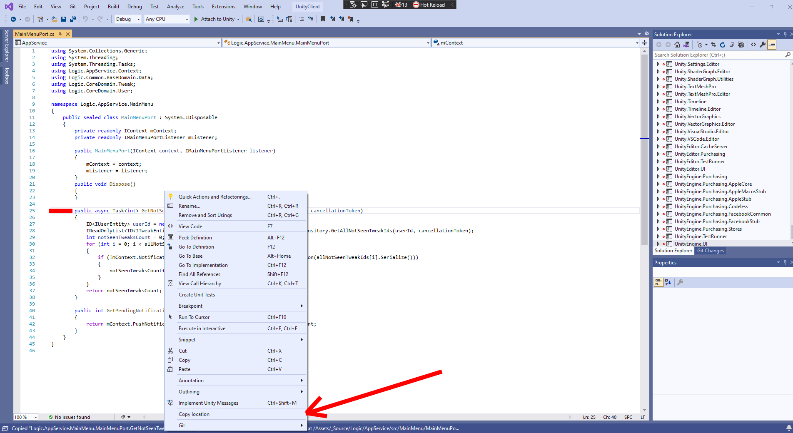

# Copy Method Location extension

This Visual Studio extension enables you to quickly copy a location of a method or property in C# to the clipboard which you can share with your colleagues.
This is useful when you do a lot of code reviews and communicate in Slack, or other messenger.

Start by right-clicking the member inside which you want to break:

The result of the copy operation looks like this:

**Logic.AppService.MainMenu.MainMenuPort.GetNotSeenTweaksCount(string userIdStr, CancellationToken cancellationToken)
at /Assets/_Source/Logic/AppService/src/MainMenu/MainMenuPort.cs[:25]**

Currently requires Visual Studio 2017 Update 7 or later. The extension can be installed in Visual Studio 2019.
